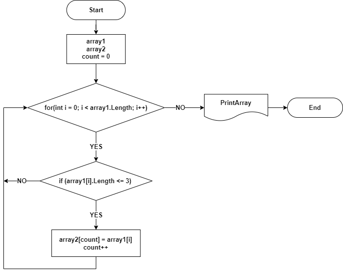

# Контрольная работа по первому блоку обучения

## ***Задача:***

    Написать программу, которая из имеющегося массива строк формирует массив из
    строк, длина которых меньше либо равна 3 символа. Первоначальный массив можно
    ввести с клавиатуры, либо задать на старте выполнения алгоритма. При решение
    не рекомендуется пользоваться коллекциями, лучше обойтись исключительно
    массивами.

### ***Решение в виде блок-схемы:***

### ***Программное решение задачи:***

    string[] array1 = { "world", "2", "hello", ":-)", "15698", "res", "Russia", "55" };
    string[] array2 = new string[array1.Length];
    int count = 0;

    Console.Write("Массив из строк, длина которых меньше или равна 3 символа: ");
    BuildArr(array1, array2);
    PrintArr(array2);

    void BuildArr(string[] arr1, string[] arr2)
    {

        for (int i = 0; i < arr1.Length; i++)
        {
            if (arr1[i].Length <= 3)
            {
                arr2[count] = arr1[i];
                count++;
            }
        }
    }

    void PrintArr(string[] arr)
    {
        Console.Write("[");
        for (int i = 0; i < arr.Length - 1 - count; i++)
        {
            Console.Write($"{arr[i]}" + ", ");
        }
        Console.WriteLine(arr[arr.Length - 1 - count] + "]");
    }
